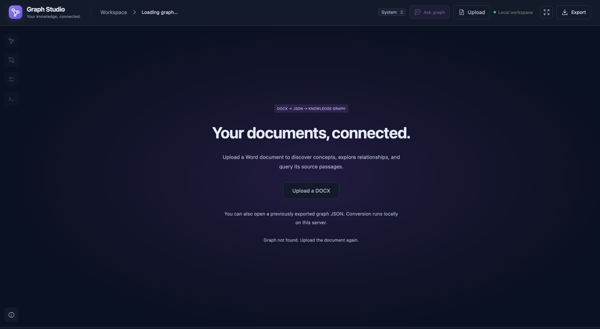
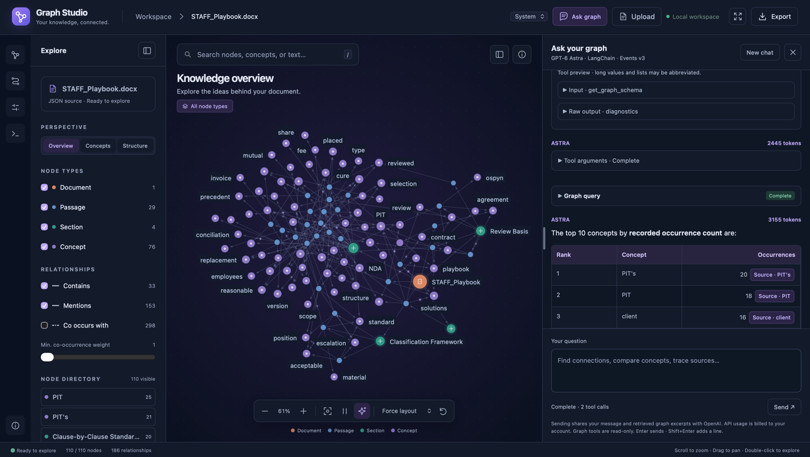
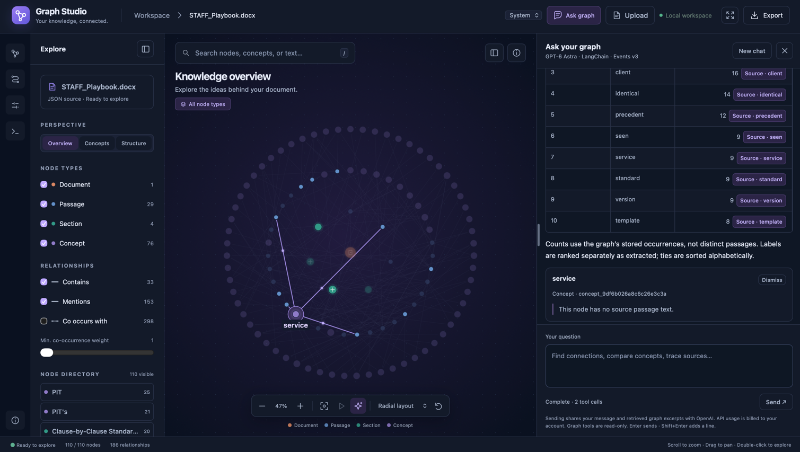
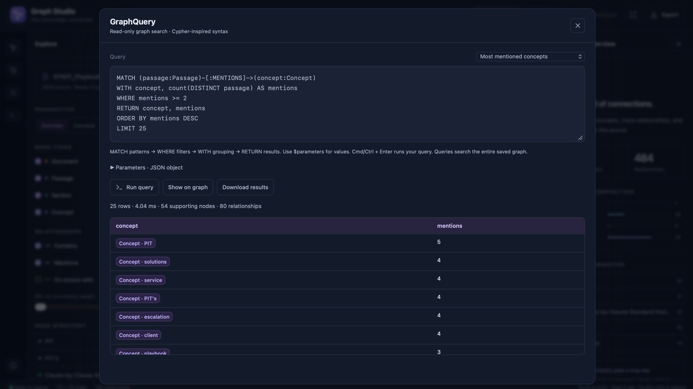

# DOCX Knowledge Graph

A standalone FastAPI workspace: upload a Word document, receive graph JSON,
and explore it immediately. The original `demo/knowledge-graph` app is unchanged;
this package does not import files from it.

> **No graph database. No vector database.**
> This system stores knowledge graphs as JSON files and searches them directly
> in memory using Python. It does not use Neo4j or any vector database.

Nodes, relationships, and source passages live in the generated graph JSON,
saved under `.data/graphs/` by default. The built-in, read-only **GraphQuery**
engine provides Cypher-inspired searches without a database server. Optional AI
chat uses tools to inspect and query that same graph, rather than retrieving
documents from a vector database.

## Start with uv

Install [uv](https://docs.astral.sh/uv/getting-started/installation/) and use
stable Python 3.11–3.14. From the repository root:

```sh
cd docx_knowledge_graph
uv sync --frozen --extra chat
uv run --frozen --extra chat docx-knowledge-graph
```

Open **http://127.0.0.1:8001**. Port 8001 avoids conflicting with the original app.
For conversion, exploration, and queries without chat dependencies, omit
`--extra chat` from both commands. No Node build, separate frontend server,
database, or API key is needed for those features. `uv.lock` pins dependencies.

1. Click **Upload document**, select or drop a `.docx`, then **Create graph**.
2. The API returns the generated JSON; the viewer renders it without a reload.
3. Use **Export → Graph JSON** to download it. You can upload exported `.json`
   graphs too, including graphs generated by the original application.
4. Refresh or bookmark the `?graph=<id>` URL to reopen the saved graph.
5. Upload another document to switch workspaces. Failed uploads keep the current
   graph; successful switches clear query results and the visible conversation.
   Stop an active chat before switching.

The existing graph layouts, search, filters, path finder, inspector, query editor,
Markdown chat, citations that keep chat open, structured tool output, animations,
system/light/dark themes, and chat resizing are retained. Drag the chat's left
border to resize; its width slider remains in **Display settings**.

## Screenshots

### Document upload

Start with a Word document or open a previously exported graph JSON file.



### Graph explorer and AI chat

Explore document relationships alongside filters, structured tool output,
Markdown answers, and source citations.



### Citation highlighting

Select a chat citation to highlight its node and connections while keeping the
conversation open.



### Custom graph queries

Run read-only, Cypher-inspired queries against the JSON graph, inspect tabular
results, show matches on the graph, or download the results.



## Server options

```sh
uv run --frozen --extra chat docx-knowledge-graph --port 8080 --data-dir ./my-data
uv run --frozen --extra chat docx-knowledge-graph --graph /absolute/path/graph.json
uv run --frozen docx-knowledge-graph --help
```

The data directory defaults to `.data` relative to the launch directory. Set
`DOCX_KG_DATA_DIR` or pass `--data-dir` to change it. Each graph is saved atomically
as `graphs/<random-id>.json`; source DOCX files are temporary and removed after
processing. Graph URLs survive restarts when the same data directory is used.
`--graph` imports an existing JSON at startup and opens it on the root page.

For development, the FastAPI application factory is also usable directly:

```sh
uv run --frozen --extra chat uvicorn docx_knowledge_graph.app:create_app --factory --port 8001
```

Run **one worker**. Admission limits, tokens, cache leases, and chat history are
process-local. This is a local workspace, not an authenticated multiuser service.
Do not expose it publicly or bind `--host 0.0.0.0` without adding authentication,
per-user authorization/storage, HTTPS, and suitable production resource limits.

## Vercel deployment

`vercel.json` configures Vercel's FastAPI preset, the `main.py` ASGI entrypoint,
a 300-second function duration, and a locked uv install with the chat extra.
`.python-version` selects Python 3.14. Static files continue through FastAPI so
the existing security headers and middleware are retained.

1. Import your GitHub repository into Vercel.
2. Set **Root Directory** to the directory containing `vercel.json` and
   `pyproject.toml`: use `.` if this folder is the repository root, otherwise
   `docx_knowledge_graph`.
3. Keep **Framework Preset: FastAPI**. Do not set a frontend Output Directory or
   a build command that starts Uvicorn; Vercel runs the exported ASGI app.
4. Enable **Deployment Protection** for every environment you intend to use,
   including production, before uploading private documents or configuring a
   shared server API key. This application has no user authentication.
5. Optionally set `OPENAI_API_KEY` in Vercel's server environment settings, or
   enter a per-tab key using the existing chat UI after deploying.

Alternatively, run these commands from the directory containing `vercel.json`:

```sh
npx vercel
```

**This configuration is for temporary previews, not reliable persistent hosting
of the current stateful backend.** In Vercel, `main.py` writes graph JSON under
the temporary directory instead of the read-only application directory. Uploads
and generated graphs are capped at 3 MiB, leaving room beneath Vercel's 4.5 MB
request/response limit; query responses remain subject to the platform limit.
The normal local CLI keeps its existing storage location and limits.

Temporary files, workspace/chat tokens, active runs, and chat history are not
shared between instances and can disappear on cold starts. Follow-up requests
can therefore fail with missing graphs, expired sessions, failed cancellation,
or token errors even before a redeployment. A single function or region does
not guarantee requests use the same instance. Download generated JSON promptly;
do not rely on a bookmark or re-upload for durable recovery on this deployment.
For reliable production operation, add shared graph storage and shared
session/token/run coordination, or keep FastAPI on a persistent server.

`.vercelignore` excludes local documents, graph exports, secrets, environments,
tests, and caches. Deployment has not been performed automatically.

References: [Vercel FastAPI](https://vercel.com/docs/frameworks/backend/fastapi),
[Python runtime](https://vercel.com/docs/functions/runtimes/python), and
[function limits](https://vercel.com/docs/functions/limitations).

## GitHub Actions: Ruff only

`.github/workflows/ruff.yml` runs only `ruff check .` on pull requests targeting
`main`, pushes to `main`, and manual runs through **Actions → Ruff → Run workflow**.
It assumes this standalone project is the GitHub repository root.

The workflow uses Python from `.python-version` and installs the locked `dev`
dependency group through uv without installing the application or chat extras.
It does not run formatting checks, tests, builds, or deployments, and requires no
secrets. Actions are pinned to commit hashes.

Use **Ruff check** as the required status check in branch protection, replacing
**Lint, test, and package** if that previous check was configured.

The existing Vercel configuration is retained, but GitHub Actions does not use it.
If your repository is connected to Vercel's native Git integration, manage its
automatic deployments separately in Vercel.

## Optional Astra chat

Start with the chat extra, open **Ask graph → API key**, paste your key into the
masked `OPENAI_API_KEY` field, and select **Use key**. No server restart is needed.
The key is retained only in this tab's memory until refresh/close; **Clear tab
key** removes it. It is not stored in local/session storage, cookies, graph files,
conversation history, or server settings. Setting it makes no OpenAI request;
OpenAI checks its validity when you send a chat message. Missing dependencies
must still be installed using `uv sync --extra chat`.

The tab key is sent only in each chat POST body, then passed directly to
`ChatOpenAI(api_key=...)` for that run. It overrides the server's
`OPENAI_API_KEY` without changing the process environment or affecting other
tabs. It stays available when you switch documents in the same tab.

Alternatively, set `OPENAI_API_KEY` in the **server environment**; it is used
when no tab key is supplied. A `.env` file is not automatically loaded. Prefer
server-managed credentials for deployed applications. This optional key entry
is intended for your trusted local workspace: use HTTPS when not on localhost,
and do not enable request-body logging in your server/proxy. Never hardcode keys
in browser JavaScript or put them in graph files, source control, or URLs.

The retained integration uses `gpt-6-astra`, LangChain `create_agent`, and the v3
event protocol. The account must have access to that model. FastAPI streams
independent model, tool, query-result, and lifecycle SSE events; **Stop** and
client disconnects cancel runs. Only the specific v3 protocol beta warning is
filtered, not unrelated warnings.

Uploading and querying do not call OpenAI. Sending a chat message shares that
message, conversation context, graph schema, and retrieved excerpts with OpenAI,
and may incur API charges. Tracing is disabled for these runs. Chat histories
are in memory, expire after one hour, and may be discarded when an idle graph
leaves the eight-graph cache or the server restarts. **New chat** resets history.

## API

The HTML is served at `/`; all JavaScript, CSS, and vendored Markdown assets are
served locally through FastAPI's `StaticFiles` mount at `/static`. Serve the UI
through FastAPI rather than opening `index.html` as a local file. No CORS setup
is required. The OpenAPI schema is at `/openapi.json`; external-CDN Swagger and
ReDoc pages are disabled to retain the self-hosted content security policy.

| Method | Route | Purpose |
| --- | --- | --- |
| GET | `/api/workspace` | Get workspace token, upload limit, initial graph ID |
| POST | `/api/documents` | Upload multipart `file` containing DOCX or graph JSON |
| GET | `/api/graphs/{graph_id}` | Retrieve graph JSON |
| GET | `/api/graphs/{graph_id}/download` | Download graph JSON as an attachment |
| POST | `/api/graphs/{graph_id}/query` | Execute `{query, parameters}` |
| GET | `/api/graphs/{graph_id}/chat/status` | Check setup and obtain graph chat token |
| POST | `/api/graphs/{graph_id}/chat` | SSE for `{message, session_id?, api_key?}` |
| POST | `/api/graphs/{graph_id}/chat/cancel` | Cancel `{run_id}` |
| POST | `/api/graphs/{graph_id}/chat/reset` | Forget `{session_id}` |

All API POSTs require `X-Workspace-Token` from the workspace endpoint.
Chat POSTs additionally require `X-Chat-Token` from that graph's chat status.
Tokens protect against cross-origin browser submissions; they are **not user
authentication**. Reload after restarting the server to obtain new tokens.
The chat status exposes `runtime_ready`, `runtime_issues`, and `key_configured`
without exposing any key. A supplied `api_key` cannot bypass missing runtime
dependencies. Omit it to use the server key; an invalid/empty supplied key is
rejected rather than silently falling back to the server's billing account.

Example using `curl` and `jq`:

```sh
base=http://127.0.0.1:8001
token=$(curl -fsS "$base/api/workspace" | jq -r .token)
curl -fsS "$base/api/documents" -H "X-Workspace-Token: $token" \
  -F 'file=@/absolute/path/document.docx' > upload-result.json
graph_id=$(jq -r .graph_id upload-result.json)
curl -fsS "$base/api/graphs/$graph_id/download" -o document.graph.json
curl -fsS "$base/api/graphs/$graph_id/query" \
  -H "X-Workspace-Token: $token" -H 'Content-Type: application/json' \
  -d '{"query":"MATCH (concept:Concept) RETURN concept LIMIT 10","parameters":{}}'
```

Upload returns HTTP 201 with `{graph_id, filename, graph, download_url}`. The
`graph` field is the original `schema_version: 1` shape: metadata, nodes, edges.
API errors use `{error: {code, message}}`; query errors also provide source
locations where available. Graph IDs are explicit per request, keeping separate
documents/tabs isolated. See [QUERY_LANGUAGE.md](QUERY_LANGUAGE.md) for syntax.

## Limits and data handling

- Uploads: 20 MiB per DOCX or JSON file, two concurrent conversions.
- DOCX: 2,000 archive entries, 32 MiB per parsed XML member, 10,000 text blocks.
  DTDs, entities, and external XML references are rejected. Legacy `.doc`, PDF,
  embedded images/OCR, and password-protected documents are unsupported.
- Saved graph: 50 MiB. Imported files still have the 20 MiB upload limit.
- Storage: 128 graphs / 1 GiB per data directory. There is no automatic deletion;
  stop the server and archive/remove old graph files to free capacity.
- Queries: bounded read-only Cypher-inspired GraphQuery, not full Neo4j/Cypher.
  Two concurrent queries; request bodies up to 64,000 bytes.
- Chat: two concurrent runs across graphs, one per graph, six turns per session,
  50 tool calls and 120 seconds per run, bounded SSE output.

Conversion extracts headings, paragraphs, table rows, and keyword concepts
offline. `CO_OCCURS_WITH` means two keywords share a passage, **not** a verified
semantic fact. Cancelling an upload stops waiting in the browser; bounded server
conversion already started may finish and persist its graph. Graphs and excerpts
can contain sensitive document content: protect and back up the data directory.

## Test and build

```sh
uv sync --frozen --extra chat
uv run --frozen --extra chat ruff format --check .
uv run --frozen --extra chat ruff check .
uv run --frozen --extra chat pytest -q
node --test tests/test_chat_markdown.cjs
uv build
```

Ruff is included in the `dev` dependency group. Its configuration in
`pyproject.toml` targets Python 3.11+, uses a 100-character formatting width,
double quotes and spaces, and checks Python errors, imports, modernization, and
common bug patterns. Generated data/build files are excluded. To format Python
source and tests or apply safe lint fixes:

```sh
uv run --frozen --extra chat ruff check --fix .
uv run --frozen --extra chat ruff format .
```

Keep `--extra chat` when running development commands to preserve the optional
chat dependencies in the uv environment. Ruff does not format JavaScript/CSS.

Python tests cover extraction, malformed uploads, XML entity rejection, request
limits, token/origin checks, persistence, document isolation, query semantics,
mocked streaming/cancellation/disconnects, and a real `create_agent` v3 pipeline
with a scripted model. Tests never make paid OpenAI calls.

`tests/test_workspace_ui.js`, `tests/test_chat_ui.js`, `tests/test_api_key_ui.js`, and
`tests/test_appearance_ui.js` export Playwright page-function snippets for the
available browser MCP's `browser_run_code_unsafe` (`filename` argument). Navigate
to the running application and run the workspace snippet first; the other two
expect a graph open. They cover desktop/mobile uploads, switching/reloading,
Markdown/citations/tools, themes, reduced motion, and border resizing. Chat
responses are intercepted locally without OpenAI calls. API-key UI tests use
dummy values and verify per-tab isolation, clearing, refresh, and request wiring.

The wheel includes the HTML, CSS, JavaScript, local vendor assets/licenses, and
chat prompt. Neither the sibling demo nor a frontend development server is
required after installation.
